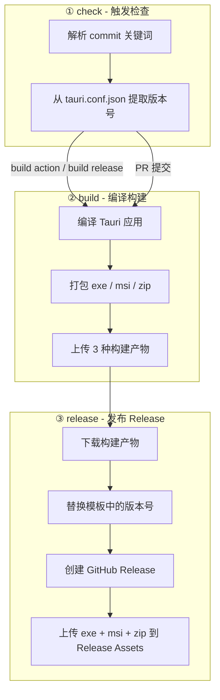

# 🔧 构建说明 (Build Guide)

本项目使用 GitHub Actions 自动构建，通过 commit message 中的关键词触发不同的构建流程。版本号自动从 `src-tauri/tauri.conf.json` 读取。

支持手动触发：在 GitHub Actions 页面点击 "Run workflow" 即可选择触发构建或发布。

## 📌 触发关键词

| 关键词 | 作用 | 说明 |
|--------|------|------|
| `build action` | 触发构建 | 编译项目并上传 Artifact（可在 Actions 页面下载） |
| `build release` | 触发发布 | 编译项目并自动创建 GitHub Release |
| `--clear` | 清除缓存 | 跳过所有缓存，从头开始完整编译 |
| PR 提交 | 自动构建 | 向 `main` 提 PR 自动触发构建但不发布 |

## 🎯 使用示例

### 1️⃣ 仅构建（不发布）

适用于：测试编译是否成功、获取测试版本

```bash
git commit -m "fix: 修复某个bug - build action"
git commit -m "feat: 新增功能 - build action"
git commit -m "test: 测试构建 - build action"
```

构建完成后，可在 GitHub Actions → 对应 workflow → Artifacts 下载 zip 包。

---

### 2️⃣ 构建并发布 Release

适用于：发布正式版本

```bash
git commit -m "release: v0.1.0 - build release"
git commit -m "chore: 准备发布 - build release"
```

会自动：
1. 编译项目
2. 创建 GitHub Release
3. 上传 zip 包到 Release Assets

---

### 3️⃣ 清除缓存重新构建

适用于：缓存可能损坏、依赖更新后需要完整重编译

```bash
# 清除缓存 + 构建
git commit -m "fix: 重新构建 - build action --clear"

# 清除缓存 + 发布
git commit -m "release: 干净构建发布 - build release --clear"
```

---

### 4️⃣ 普通提交（不触发构建）

不包含关键词的提交不会触发任何构建：

```bash
git commit -m "docs: 更新文档"
git commit -m "style: 调整代码格式"
git commit -m "refactor: 重构代码"
```

---

## 🔀 关键词组合规则

| Commit Message | 触发构建? | 触发发布? | 使用缓存? |
|----------------|----------|----------|----------|
| `fix: bug` | ❌ | ❌ | - |
| `fix: bug - build action` | ✅ | ❌ | ✅ |
| `fix: bug - build release` | ✅ | ✅ | ✅ |
| `fix: bug - build action --clear` | ✅ | ❌ | ❌ |
| `fix: bug - build release --clear` | ✅ | ✅ | ❌ |

---

## 🏗️ 流水线阶段

```
check ──→ build ──→ release
  │         │         │
  │         │         └─ 下载构建产物
  │         │            替换模板中的 {{version}}
  │         │            创建 GitHub Release
  │         │            上传 exe + msi + zip
  │         │
  │         └─ 编译 Tauri 应用 (Rust)
  │            打包 exe / msi / zip
  │            上传 3 种构建产物
  │
  ├─ 解析 commit 关键词 (build action / build release / --clear)
  ├─ 从 tauri.conf.json 提取版本号
  └─ PR 提交自动触发构建（不发布）
```



---

## ⏱️ 构建时间参考

| 场景 | 预计时间 |
|------|---------|
| 首次构建（无缓存） | ~7-10 分钟 |
| 有缓存的增量构建 | ~2-4 分钟 |
| 清除缓存重新构建 | ~7-10 分钟 |

---

## 📦 构建产物

构建成功后会生成 3 种产物（文件名中的 `v{version}` 自动替换为实际版本）：

| 类型 | 文件名 | 说明 |
|------|--------|------|
| EXE | `wangyi-mc-checkworld-v{version}-windows-x64.exe` | 独立可执行文件，直接运行 |
| MSI | `wangyi-mc-checkworld-v{version}-windows-x64.msi` | Windows 安装程序 |
| ZIP | `wangyi-mc-checkworld-v{version}-windows-x64-green.zip` | 便携压缩包（解压后运行 exe） |

Release 发布时会同时上传以上 3 个文件到 Release Assets。

## 🧾 Release 文案模板

GitHub Release 的正文文案已单独拆到：

`./.github/workflows/release-template.md`

这样以后如果你想单独调整：

- `📦 二进制形式说明`
- `✨ 功能`
- `🖥️ 系统要求`

只需要改这个 Markdown 文件，不需要再直接修改 `build.yml`。

---

## 🔗 相关链接

- [GitHub Actions 页面](../../actions) - 查看构建状态和下载 Artifact
- [Releases 页面](../../releases) - 查看和下载正式发布版本
