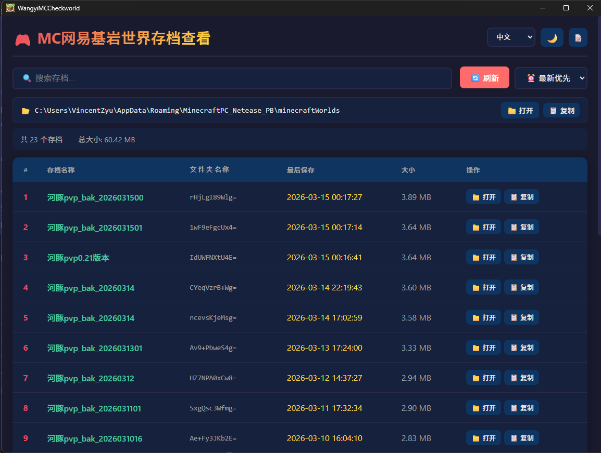
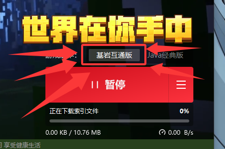

# MC NetEase World Manager

[](https://github.com/VincentZyuApps/wangyi-mc-checkworld-tauri)
[](https://gitee.com/vincent-zyu/wangyi-mc-checkworld-tauri)

一个用 Rust + Tauri 构建的网易我的世界电脑版存档管理工具。

## 🛠️ 技术栈

| 名称 | 版本 | 作用 |
|------|------|------|
|  | stable | 系统级编程语言，安全、高性能 |
|  | 0.2.7 | 轻量级跨平台桌面应用框架（Webview + Rust 后端） |
|  | 0.2.7 | Tauri 构建时工具，编译时生成上下文和嵌入资源 |
|  | 2 | 允许前端调用系统 shell（打开文件夹、文件、网址等） |
|  | 0.2.7 | Rust 序列化/反序列化库，处理配置和数据交换 |
|  | 1.0 | JSON 支持，配合 serde 处理前后端数据 |
|  | 0.2.7 | 日期时间处理，带 serde 支持，记录存档时间戳 |
|  | 2.4 | 高效遍历目录树，扫描存档文件夹 |
|  | 1.3 | 增强版文件操作，复制/移动/重命名文件夹 |
|  | 0.6 | ZIP 压缩/解压，打包存档为 .zip 备份 |

## ✨ 功能

- 📂 **列出存档** - 显示所有存档的名称、文件夹、保存时间和大小
- 🔍 **搜索过滤** - 按名称或文件夹名搜索
- 📊 **多种排序** - 按时间、名称、大小排序
- 💾 **备份存档** - 一键打包为 ZIP 文件
- ✏️ **重命名存档** - 修改存档显示名称
- 🗑️ **删除存档** - 安全删除不需要的存档
- 🎨 **深色主题** - 现代化暗色 UI 界面

## 🔧 核心原理

应用通过环境变量 `%APPDATA%` 自动定位存档目录：`%APPDATA%\MinecraftPC_Netease_PB\minecraftWorlds`，无需手动配置。

利用 Windows 环境变量动态获取用户应用数据目录，确保跨用户兼容性和自动化部署。

## 📸预览



## 📦 下载安装

### 方式 1：下载预编译版本

[](https://github.com/VincentZyuApps/wangyi-mc-checkworld-tauri/releases)

前往 [Releases](https://github.com/VincentZyuApps/wangyi-mc-checkworld-tauri/releases) 页面下载最新版本的 ZIP 包，解压后直接运行 `wangyi-mc-checkworld-tauri.exe`。

### 方式 2：从源码构建

需要安装 [Rust](https://rustup.rs/) 和 [Tauri CLI](https://tauri.app/)：

```bash
# 克隆仓库 (GitHub)
git clone https://github.com/VincentZyuApps/wangyi-mc-checkworld-tauri.git
cd wangyi-mc-checkworld-tauri

# 或克隆仓库 (Gitee)
git clone https://gitee.com/vincent-zyu/wangyi-mc-checkworld-tauri.git
cd wangyi-mc-checkworld-tauri

# 安装 Tauri CLI
cargo install tauri-cli

# 构建发布版本
cargo tauri build
```

构建完成后，可执行文件位于 `src-tauri/target/release/` 目录。

## 🔧 开发

```bash
# 开发模式运行
cargo tauri dev
```

## 🚀 GitHub Actions 自动构建

本项目使用 GitHub Actions 自动构建。在 commit message 中包含以下关键词可触发相应操作：

| 关键词 | 作用 |
|--------|------|
| `build action` | 触发构建并上传 Artifact |
| `build release` | 触发构建并创建 Release |
| `--clear` | 清除缓存，从头编译 |

示例：
```bash
git commit -m "feat: add new feature - build action"
git commit -m "chore: prepare v1.0 - build release"
git commit -m "fix: rebuild - build action --clear"
```

👉 **详细说明请查看 [BUILD.md](.github/workflows/BUILD.md)**

## 📁 项目结构

```
wangyi-mc-checkworld-tauri/
├── src/                    # 前端文件
│   ├── index.html
│   ├── main.js
│   └── styles.css
├── src-tauri/              # Rust 后端
│   ├── Cargo.toml
│   ├── tauri.conf.json
│   └── src/
│       └── main.rs
├── .github/
│   └── workflows/
│       └── build.yml       # GitHub Actions
└── README.md
```

## 🖥️ 系统要求

- Windows 10/11 x64 (仅支持 64 位)
- 已安装网易我的世界电脑版(基岩互通版) 